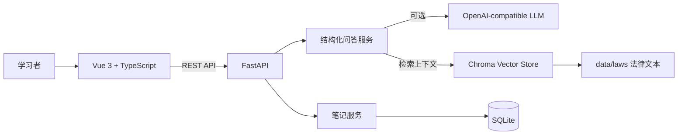

<div align="center">

# 法小智 · Law Assistant

### 把法律问题，变成一个可掌握的系统。

一个面向法律学习者的 AI 学习工作台。它不止回答问题，还会把知识拆解为概念、构成要件、案例、常见误区、法条依据与易混概念，并沉淀为可持续复习的个人知识库。

[](https://vuejs.org/)
[](https://www.typescriptlang.org/)
[](https://fastapi.tiangolo.com/)
[](https://www.python.org/)
[](https://www.sqlite.org/)
[](https://www.trychroma.com/)

</div>

> [!IMPORTANT]
> 本项目定位为法律学习与知识整理工具，不构成法律意见，也不能替代执业律师针对具体案件提供的专业服务。

## 项目亮点

| 能力 | 说明 |
| --- | --- |
| **结构化法律问答** | 将回答组织为概念、要件、案例、误区、法条和易混点，而不是输出难以吸收的长段文本。 |
| **上下文追问** | 携带当前学习轨迹继续提问，让后续解释与前文保持一致。 |
| **本地法律 RAG** | 从 `data/laws/` 检索相关法律材料，通过 Chroma 为模型补充上下文。 |
| **学习笔记** | 将一次或多次问答保存为结构化笔记，并通过 SQLite 持久化。 |
| **复习模式** | 从已保存笔记进入复习流程，支持“已掌握 / 稍后复习 / 再练一道”等学习动作。 |
| **学习洞察** | 汇总最近学习、待复习主题、知识分类与易混概念，形成长期学习视图。 |
| **双运行模式** | 未配置模型时使用内置演示答案；启用 LLM 后切换到真实 AI + RAG 链路。 |

## 产品体验

项目包含完整的学习路径，而不只是一个聊天页面：

1. 在营销首页了解产品理念并进入工作台。
2. 提出法律问题，获得结构化学习卡片。
3. 围绕当前内容继续追问，形成连续的学习轨迹。
4. 将结果保存为笔记，沉淀到个人知识库。
5. 在笔记、复习与洞察页面持续巩固。

主要页面：

- `/`：产品首页
- `/home`：AI 法律学习工作台
- `/notes`：结构化笔记库
- `/review`：复习模式
- `/insights`：学习数据与知识洞察

## 系统架构



## 技术栈

**前端**

- Vue 3 + TypeScript
- Vue Router
- Tailwind CSS
- Motion for Vue
- Vite

**后端**

- FastAPI + Uvicorn
- Pydantic
- SQLAlchemy + SQLite
- HTTPX
- ChromaDB
- OpenAI-compatible Chat Completions / Embeddings API

## 快速开始

### 环境要求

- Python 3.12+
- Node.js 20+
- npm

### 1. 安装后端依赖

在仓库根目录执行：

```bash
python3 -m pip install -r requirements.txt
```

也可以使用 `uv`：

```bash
uv sync
```

### 2. 启动后端

```bash
python3 -m uvicorn main:app --reload --host 0.0.0.0 --port 8000
```

后端可用后，可以访问：

- API 文档：<http://127.0.0.1:8000/docs>
- 健康检查：<http://127.0.0.1:8000/health>

### 3. 启动前端

另开一个终端：

```bash
cd frontend
npm install
npm run dev -- --host 0.0.0.0 --port 5173
```

打开 <http://127.0.0.1:5173> 即可进入应用。

> 默认情况下，前端请求 `http://127.0.0.1:8000`。如后端部署在其他地址，请设置 `VITE_API_BASE_URL`。

## AI 与 RAG 配置

后端启动时会自动读取 `backend/.env`。不创建该文件也可以运行，此时系统使用内置演示回答，适合界面开发和本地体验。

要启用真实 AI 问答，在 `backend/.env` 中配置：

```dotenv
LLM_ENABLED=true
LLM_PROVIDER=openai_compatible
LLM_API_KEY=your_api_key
LLM_BASE_URL=https://api.openai.com/v1
LLM_MODEL=your_chat_model
LLM_TIMEOUT_SECONDS=30
LLM_TEMPERATURE=0.2

OPENAI_EMBEDDING_MODEL=text-embedding-3-small
CHROMA_PERSIST_DIR=backend/data/chroma
```

前端连接远程后端时，可以在 `frontend/.env.local` 中配置：

```dotenv
VITE_API_BASE_URL=https://your-backend.example.com
```

### 构建法律文本索引

将 UTF-8 编码的 `.txt` 法律材料放入 `data/laws/`，然后在仓库根目录执行：

```bash
python3 -m app.rag.ingest
```

查看某个问题的检索结果：

```bash
python3 -m app.rag.retriever "什么是不安抗辩权？"
```

索引默认持久化到 `backend/data/chroma/`。重复执行 ingest 命令会重建集合。

## API 概览

| 方法 | 路径 | 用途 |
| --- | --- | --- |
| `GET` | `/health` | 服务健康检查 |
| `POST` | `/api/ask` | 提交问题与历史上下文，返回结构化学习结果 |
| `POST` | `/api/notes` | 保存结构化学习笔记 |
| `GET` | `/api/notes` | 获取笔记列表 |
| `GET` | `/api/notes/{note_id}` | 获取单条笔记详情 |

问答接口示例：

```bash
curl --request POST http://127.0.0.1:8000/api/ask \
  --header "Content-Type: application/json" \
  --data '{"question":"什么是不安抗辩权？","history":[]}'
```

返回内容遵循稳定的结构化协议：

```json
{
  "question": "什么是不安抗辩权？",
  "concept": "概念说明",
  "elements": ["构成要件"],
  "example": "案例说明",
  "mistakes": ["常见误区"],
  "statutes": [
    {
      "title": "《中华人民共和国民法典》",
      "article": "第五百二十七条",
      "content": "法条内容"
    }
  ],
  "confusions": [
    {
      "term": "先履行抗辩权",
      "difference": "概念区别"
    }
  ]
}
```

## 数据与存储

- SQLite 数据库：`backend/law_assistant.db`
- 法律文本源：`data/laws/`
- Chroma 向量索引：`backend/data/chroma/`
- 数据库表会在 FastAPI 启动时自动创建，无需额外初始化命令。

## 项目结构

```text
law-assistant/
├── main.py                         # 根目录 ASGI 入口
├── app/                            # 将 backend/app 暴露为根目录 Python 包
├── requirements.txt                # Python 依赖入口
├── pyproject.toml                  # uv / Python 项目配置
├── Makefile                        # systemd 部署与服务管理
├── backend/
│   ├── app/
│   │   ├── api/                    # 问答与笔记接口
│   │   ├── db/                     # 数据库会话与初始化
│   │   ├── models/                 # SQLAlchemy 模型
│   │   ├── rag/                    # 文本切块、向量化与检索
│   │   ├── schemas/                # Pydantic 请求/响应模型
│   │   ├── services/               # LLM 与笔记业务逻辑
│   │   ├── config.py               # 环境变量与路径配置
│   │   └── main.py                 # FastAPI 应用定义
│   └── tests/                      # 后端单元测试
├── frontend/
│   ├── src/
│   │   ├── components/             # 学习、营销、笔记组件
│   │   ├── pages/                  # 页面级视图
│   │   ├── layouts/                # 应用布局
│   │   ├── router/                 # 前端路由
│   │   ├── lib/api.ts              # API 客户端
│   │   └── types/                  # TypeScript 类型
│   └── package.json
├── data/laws/                      # 本地法律材料
├── deploy/systemd/                 # Linux 服务模板
└── docs/                           # API、设计与部署文档
```

## 测试与构建

运行后端测试：

```bash
python3 -m unittest discover -s backend/tests -p "test_*.py"
```

检查前端生产构建：

```bash
cd frontend
npm run build
```

## Linux 服务部署

仓库提供 `Makefile` 与 systemd 模板，适合没有 Docker 的 Linux 服务器：

```bash
make up
```

常用服务命令：

```bash
make status    # 查看前后端状态
make logs      # 持续查看日志
make restart   # 重启前后端
make down      # 停止前后端
```

`make up` 会安装依赖、生成 `.systemd/` 服务文件、写入 systemd、设置开机启动并启动前后端，因此需要 `sudo` 权限。

更完整的部署说明见 [Vercel 部署文档](docs/deployment/2026-04-14-vercel-deployment.md)，LLM 接口约定见 [LLM Integration API](docs/api/2026-04-10-llm-integration-api.md)。

---

<div align="center">
  <sub>为理解而设计，为长期学习而构建。</sub>
</div>
